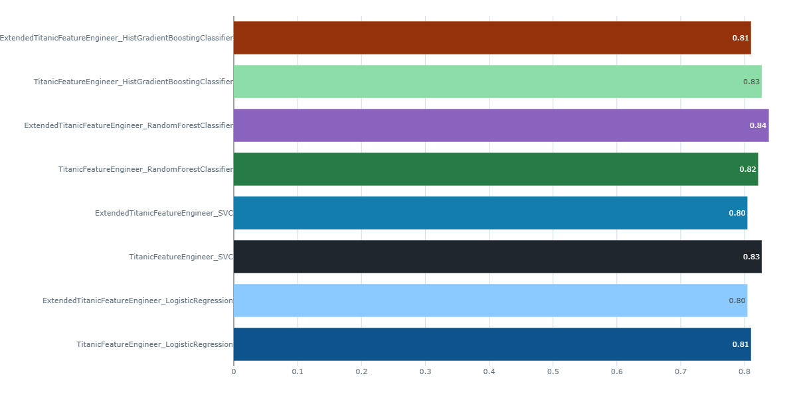

# Kaggle competitions repository

Welcome to my data science toy projects repo! This repository showcases my skills for current and future employers. My goal? To have fun while sharing best practices and templates for various data tasks. Thanks to Kaggle for supplying the datasets, a bit of structure, and some healthy competition to keep things interesting.
  
Following is each project description, scope and structure.
# Projects 

## MLflow titanic

This project is a template for creating a **MLOps** training pipeline using **MLflow**.
MLflow is used to manage the entire machine learning lifecycle, including experiment tracking, model packaging, and deployment. 
The objective is to **track and evaluate multiple experiments** on two versions of the same dataset, generated through feature engineering, in order to determine which set of variables performs more effectively.

  
Project structure

  ### Data
  [Titanic - Machine Learning from Disaster](https://www.kaggle.com/competitions/titanic/data)

  ### Modeling and Methodology

  The exploratory data analysis **(EDA)** can be found in the `notebooks/`folder.  
  The `MLflow_titanic/titanic_feature_engineer.py` file contains 2 custom transformers used for feature engineering. `TitanicFeatureEngineer` adds 5 more features, `ExtendedTitanicFeatureEngineer` adds 12. 
  the `MLflow_titanic\classifiers_mlflow_experiments.py` run the experiment. It performs:
  
1. Get data and set up train-test split
2. Initialize MLflow
3. generate a pipeline **FE &rarr; model training** for each of the four chosen classifiers, the model parameters are fine-tuned via grid search. Each model will be tracked twice, once for each custom feature engineering transformer. Models:
    - Logistic Regression
    - Support Vector Classifier
    - Random Forest Classifier
    - Histogram-based Gradient Boosting Classification Tree  (cos it handles alone missing data)
4. `Sklearn pipelines` are used for preprocessing and modeling 

  ### Results
the model with the best performance is found to be the Random Forest Classifier over the  `TitanicFeatureEngineer` tranformer.

The `submission.py` file extracts the `submission.csv`, it obtained an 80% score on the Kaggle competition. 

  ## Next project

